## Operaciones CRUD Principales

:::tip[Operaciones CRUD Principales]
    1. [Operarios](/api/operarios)
    2. [Registros de Producción](/api/registros_produccion)
    3. [Referencias](/api/referencias)
:::

## Flujo de la aplicación

