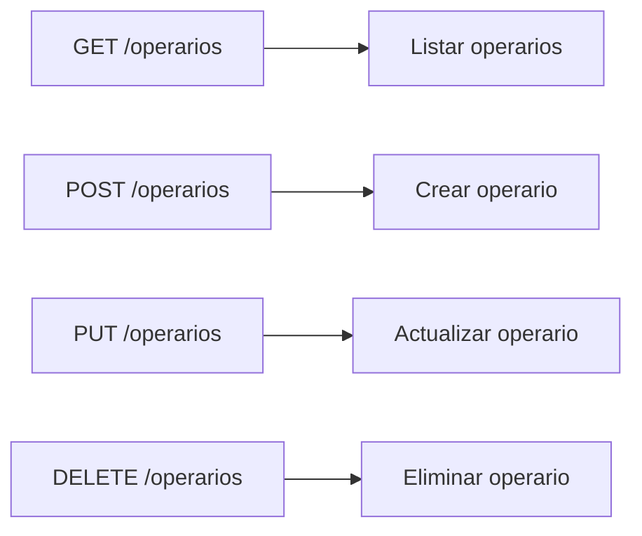

### 1. CRUD Operarios

Aquí se encuentran los endpoints para la gestión de operarios.



### 2. Estructura de Datos
    POST /operarios
    ```json
    {
        "nombreOperario": "string",
        "modulo": "string"
    }
    ```

    GET /operarios
    ```json
    {
        "nombreOperario": "string",
        "modulo": "string",
        "estado": "boolean",
        "revisor": "boolean"
    }
    ```
    PUT /operarios
    ```json
    {
        "nombreOperario": "string",
        "modulo": "string",
        "estado": "boolean",
        "revisor": "boolean"
    }
    ```

    DELETE /operarios
    ```json
    {
        "id": "int"
    }
    ```