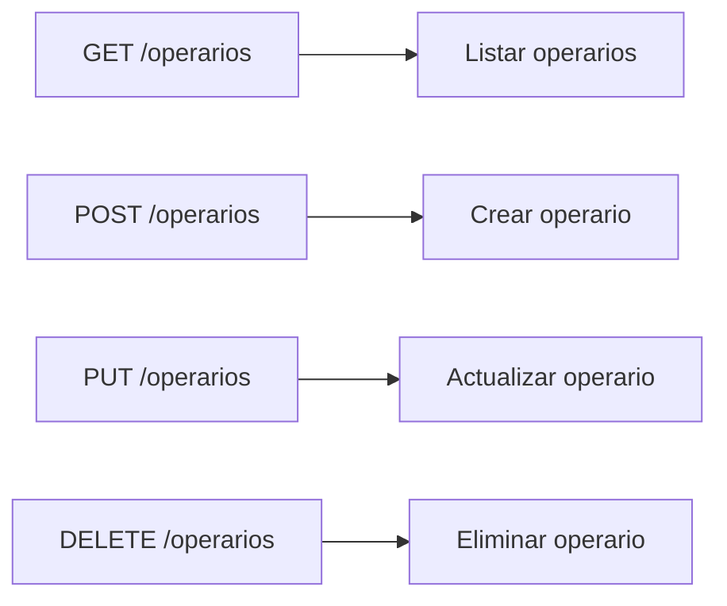

### 1. CRUD Operarios

Aquí se encuentran los endpoints para la gestión de operarios.



### 2. Estructura
#### 2.1. Crear Operario
    POST /operarios
    ```bash
        http://localhost:80/CREATE/almacenarOperario.php
    ```
    ```json
    {
        "nombreOperario": "string",
        "modulo": int
    }
    ```
    
#### 2.2. Listar Operarios
##### Solicitud
    GET /operarios
     ```bash
        http://localhost:80/eliminarOperario.php?modulo=int&redux=boolean
    ```

#### 2.3. Actualizar Operario
##### Solicitud
    PUT /operarios
     ```bash
        http://localhost:80/UPDATE/actualizarOperario.php?id=int
    ```
    ```json
    {
        "nombreOperario": "string",
        "modulo": int,
        "estado": boolean,
        "revisor": boolean
    }
    ```

#### 2.4. Eliminar Operario
##### Solicitud
    DELETE /operarios
    ```bash
        http://localhost:80/DELETE/eliminarOperario.php?id=int
    ```

#### 2.5. Respuesta
     Respuesta generalizada para cada peticion: 
    ```json
    {
        "ok": "boolean",
        "message": "string"
    }
    ```
## 3. Backend

    
    > En este diagrama de flujo, podemos ver los filtros y operaciones que se realizan al momento de realizar una solicitud del tipo GET a la API
