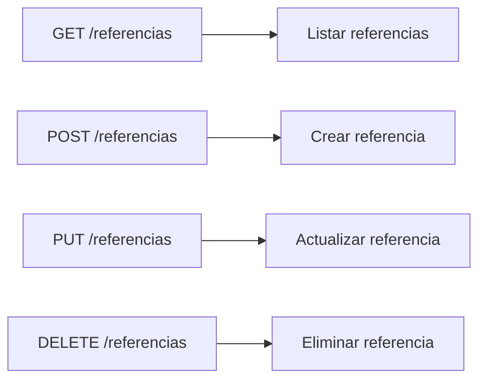

Aquí se encuentran los endpoints para la gestión de referencias.



### 2. Estructura de Datos
    POST /referencias
    ```json
    {
        "codigoReferencia": "string",
        "tiempoTarea": "int",
        "modulo": "int",
    }
    ``` 

    GET /referencias
    ```json
    {
        "id": "int",
        "codigoReferencia": "string",
        "tiempoTarea": "int",
        "modulo": "int",
        "estado": "boolean",
    }
    ```

    PUT /referencias
    ```json
    {
        "id": "int",
        "codigoReferencia": "string",
        "tiempoTarea": "int",
        "modulo": "int",
        "estado": "boolean",
    }
    ```


