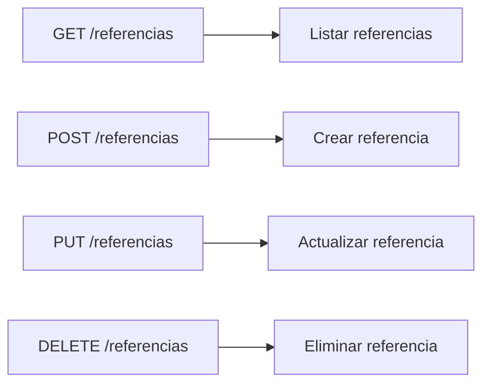

Aquí se encuentran los endpoints para la gestión de referencias.



### 2. Estructura 

#### 2.1. Crear Referencia
    POST /referencias
    ```bash
        http://localhost:80/CREATE/almacenarReferencia.php
    ```
    ```json
    {
        "codigoReferencia": "string",
        "tiempoTarea": "int",
        "modulo": "int",
    }
    ``` 

#### 2.2. Listar Referencias
    GET /referencias
    ```bash
        http://localhost:80/DELETE/eliminarReferencia.php?id=int&modulo=int
    ```
    ```json
    {
        "id": "int",
        "codigoReferencia": "string",
        "tiempoTarea": "int",
        "modulo": "int",
        "estado": "boolean",
    }
    ```

#### 2.3. Actualizar Referencia
    PUT /referencias
    ```bash
        http://localhost:80/UPDATE/actualizarReferencia.php?id=int
    ```
    ```json
    {
        "id": "int",
        "codigoReferencia": "string",
        "tiempoTarea": "int",
        "modulo": "int",
        "estado": "boolean",
    }
    ```

#### 2.5. Respuesta
     Respuesta generalizada para cada peticion: 
    ```json
    {
        "ok": "boolean",
        "message": "string"
    }
    ```


