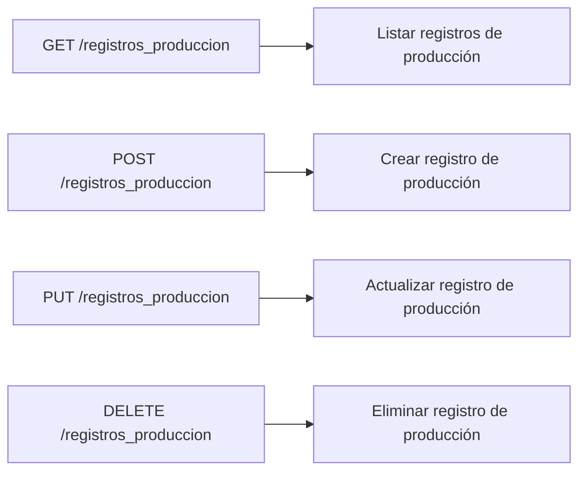

Aquí se encuentran los endpoints para la gestión de registros de producción.


```mermaid
flowchart LR
    A[GET /registros_produccion] --> B[Listar registros de producción]
    C[POST /registros_produccion] --> D[Crear registro de producción]
    E[PUT /registros_produccion] --> F[Actualizar registro de producción]
    G[DELETE /registros_produccion] --> H[Eliminar registro de producción]
```

### 2. Estructura de Datos
    POST /registros_produccion
    ```json
    {
        "": "int",
    }
    ```
