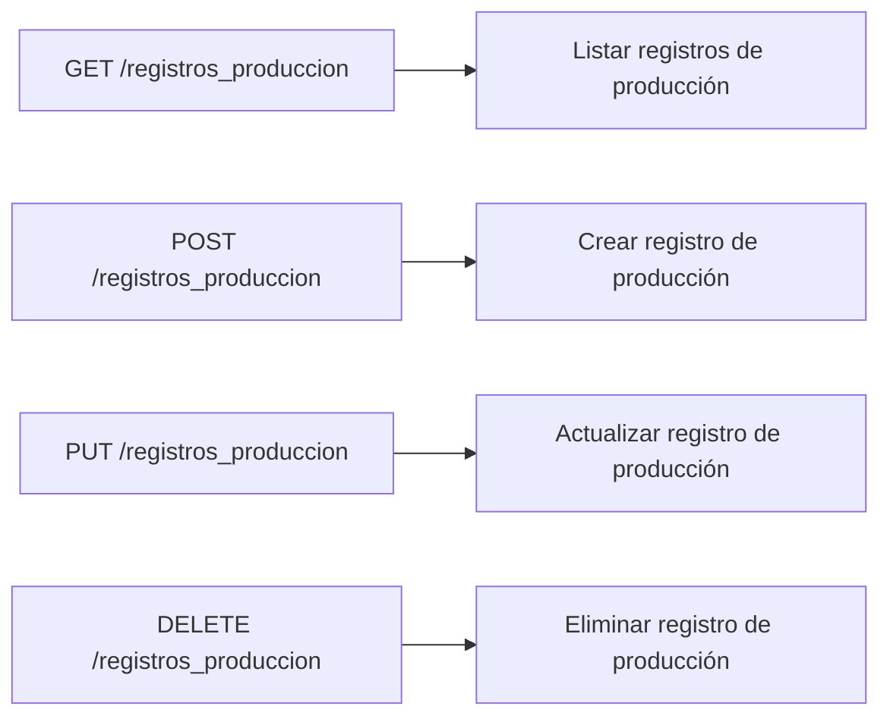

Aquí se encuentran los endpoints para la gestión de registros de producción.



### 2. Estructura
#### 2.1 Crear registro de operación
##### Solicitud
    POST /registros_produccion
    ```bash
        http://localhost:80/CREATE/almacenarRegistroOperaciones.php
    ```
    ```json
    {
    "operario": int,
    "unidadesProducidas": int,
    "referencia": int,
    "adicionales": "string"
    }
    ```
#### 2.2 Eliminar registro de producción
##### Solicitud
    DELETE /registros_produccion
    ```bash
        http://localhost:80/DELETE/eliminarRegistroOperaciones.php?id=int
    ```

#### 2.3 Actualizar registro de producción
##### Solicitud
    PUT /registros_produccion
    ```bash
        http://localhost:80/UPDATE/actualizarRegistroOperaciones.php?id=int
    ```
    ```json
    {
        "operario": int,
        "unidadesProducidas": int,
        "referencia": int,
        "adicionales": "string"
    }
    ```

#### 2.4 Respuesta
    Respuesta generalizada para cada peticion: 
    ```json
    {
        "ok": "boolean",
        "message": "string || array"
    }
    ```