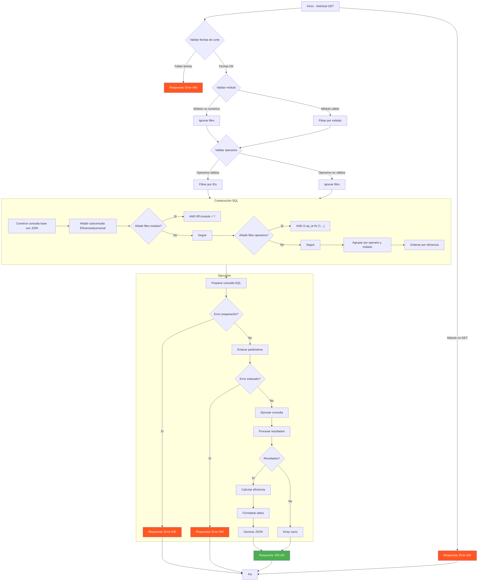

Aquí se encuentran los endpoints para la gestión de tableros.


```mermaid
flowchart TD
    A[Inicio - Solicitud GET] --> B{Validar fechas de corte}
    B -->|Faltan fechas| C["Respuesta: Error 400"]
    B -->|Fechas OK| D{Validar módulo}
    D -->|Módulo no numérico| E["Ignorar filtro"]
    D -->|Módulo válido| F["Filtrar por módulo"]
    E --> G{Validar operarios}
    F --> G
    G -->|Operarios no válidos| H["Ignorar filtro"]
    G -->|Operarios válidos| I["Filtrar por IDs"]

    subgraph Construcción_SQL["Construcción SQL"]
        J["Construir consulta base con JOIN"]
        J --> K["Añadir subconsulta EficienciaQuincenal"]
        K --> L{"Añadir filtro módulo?"}
        L -->|Sí| M["AND RP.modulo = ?"]
        L -->|No| N["Seguir"]
        N --> O{"Añadir filtro operarios?"}
        O -->|Sí| P["AND O.op_id IN (?,...)"]
        O -->|No| Q["Seguir"]
        Q --> R["Agrupar por operario y módulo"]
        R --> S["Ordenar por eficiencia"]
    end

    I --> Construcción_SQL
    H --> Construcción_SQL

    subgraph Ejecución["Ejecución"]
        T["Preparar consulta SQL"]
        T --> U{"Error preparación?"}
        U -->|Sí| V["Respuesta: Error 500"]
        U -->|No| W["Enlazar parámetros"]
        W --> X{"Error enlazado?"}
        X -->|Sí| Y["Respuesta: Error 500"]
        X -->|No| Z["Ejecutar consulta"]
        Z --> AA["Procesar resultados"]
        AA --> BB{"Resultados?"}
        BB -->|Sí| CC["Calcular eficiencia"]
        BB -->|No| DD["Array vacío"]
        CC --> EE["Formatear datos"]
        EE --> FF["Generar JSON"]
    end

    Construcción_SQL --> T
    FF --> GG["Respuesta: 200 OK"]
    DD --> GG
    V --> HH[Fin]
    Y --> HH
    GG --> HH

    A -->|Método no GET| II["Respuesta: Error 400"]
    II --> HH

    style C fill:#FF5722,color:white
    style V fill:#FF5722,color:white
    style Y fill:#FF5722,color:white
    style II fill:#FF5722,color:white
    style GG fill:#4CAF50,color:white
```

## Estructura de datos

```json
{
    "fecha": "string",
    "operarios": "string",
    "modulo": "int"
}
```
