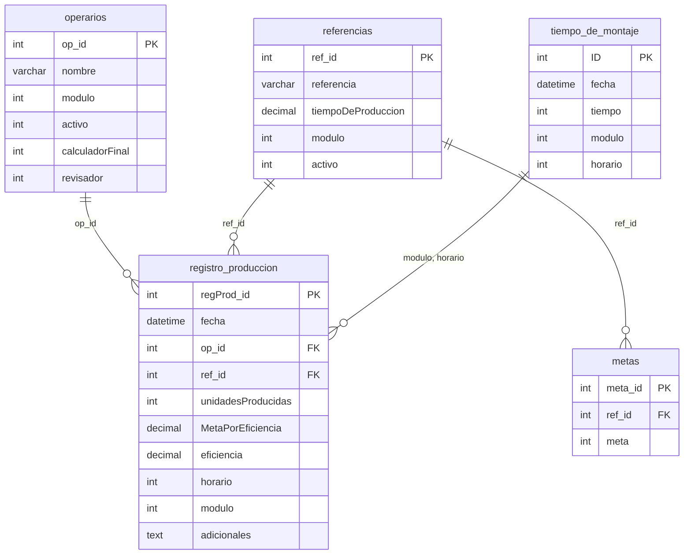

import { Card, CardGrid } from '@astrojs/starlight/components';

La base de datos es posiblemente la parte mas importante de la aplicación, ya que es la que se encarga de realizar todos los calculos y almacenar los datos para su posterior uso.

## Estructura de la base de datos

La base de datos se compone de 4 tablas, las cuales se detallan a continuación:

<CardGrid stagger title="Estructura de la base de datos">
    <Card title="Tabla de operarios">
        - (PK)op_id: int
        - nombre: varchar(255)
        - modulo: int
        - activo: boolean
        - revisador: boolean
    </Card>
    <Card title="Tabla de registros de producción">
        - (PK)regProd_id: int
        - fecha: date
        - (FK)op_id: int
        - (FK)ref_id: int
        - unidadesProducidas: int
    </Card>
    <Card title="Tabla de referencias">
        - (PK)ref_id: int
        - referencia: varchar(255)
        - tiempoDeProduccion: float
        - modulo: int
        - activo: boolean
    </Card>
    <Card title="Tabla de metas">
        - (PK)meta_id: int
        - (FK)ref_id: int
        - meta: int
    </Card>
    <Card title="Tabla de tiempo de montaje">
        - (PK)ID: int
        - fecha: date
        - tiempo: int
        - modulo: int
        - horario: int
    </Card>
</CardGrid>

## Diagrama entidad-relación de la base de datos

