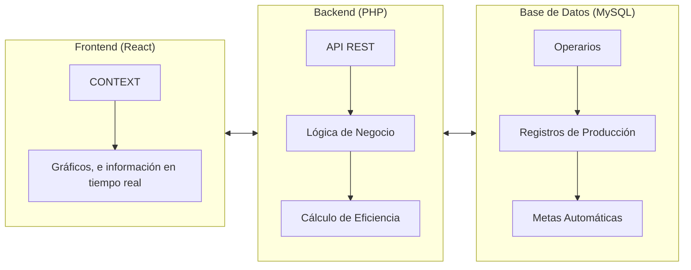

La arquitectura del proyecto se basa en un sistema similar al de microservicios, que se encargan de la logica de negocio del proyecto.
 
Representado en un diagrama, se puede ver de la siguiente manera:

