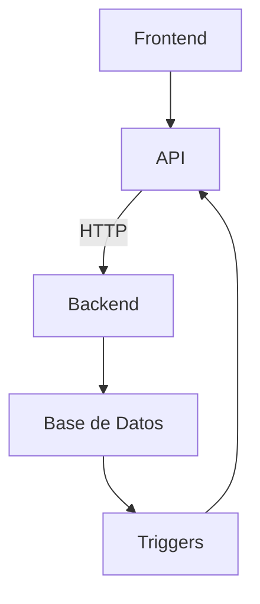

import { Card, CardGrid } from '@astrojs/starlight/components';

En este apartado, se listarán todas las tecnologías que se utilizaron para el desarrollo del medidor de eficiencia.

<CardGrid>
	<Card title="PHP" icon="seti:php">
		:::note[¿Que es?]
        PHP es un lenguaje de programación de proposito general que se ejecuta del lado del servidor.
        :::
         
        En este caso, se utilizó PHP para la lógica de lado del servidor del medidor de eficiencia.
	</Card>
	<Card title="MySQL" icon="seti:db">
		:::note[¿Que es?]
        MySQL es un sistema de gestión de bases de datos relacional.
        :::
         
        En este caso, se utilizó MySQL para la base de datos del medidor de eficiencia junto con multiples triggers que se encargan de mantener la consistencia de los datos dentro del almacenamiento
	</Card>
    <Card title="React" icon="seti:react">
        :::note[¿Que es?]
        React es un framework de JavaScript para crear interfaces de usuario.
        :::
         
        En este caso, se utilizó React para la interfaz de usuario del medidor de eficiencia.   
    </Card>
</CardGrid>

### Flujo de datos del medidor de eficiencia

